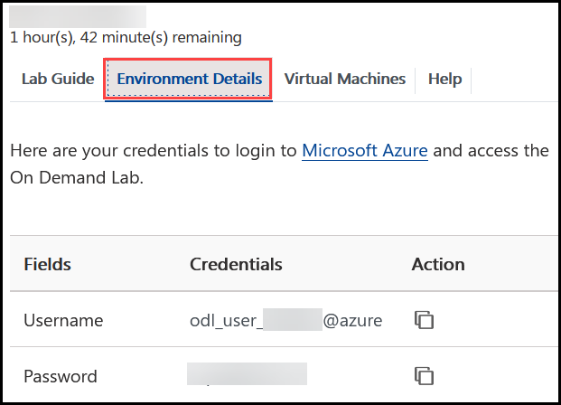
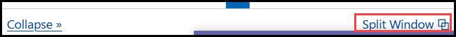
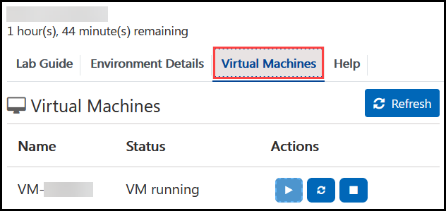
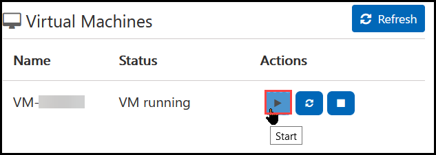
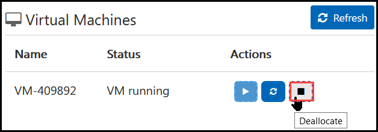
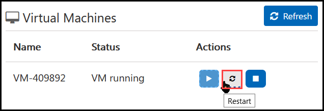

# Getting Started with Lab

1. Once the environment is provisioned, a virtual machine (JumpVM) and lab guide will get loaded in your browser. Use this virtual machine throughout the workshop to perform the the lab.
1. To get the lab environment details, you can select **Environment Details** tab. Additionally, the details will also be emailed to your email address provided at registration.

   
 
    > You will see VM details in the **Lab Environment** tab
 
1. You can also open the Lab Guide on Separate full window by clicking on the icon on  the top right corner.

   
 
## Start/Stop the Virtual Machine
1. On the environment details tab, click on the **Lab Resources tab**.

   

1. To Start the VM, on the Lab Resources tab click on the **...** under *Actions*. Now click on **Start**.

   

1. To Stop the VM, on the Lab Resources tab click on the **...** under *Actions*. Now click on **Stop**.

   

1. To Restsrt the VM, on the Lab Resources tab click on the **...** under *Actions*. Now click on **Restart**.

   

1. If you have more than one VM, you can perform the above mentioned actions in all the VMs by clicking on the required button as mentioned in the image below.

   
