# Getting Started with RPA in a Day Lab

1. Once the environment is provisioned, a virtual machine (JumpVM) and lab guide will get loaded in your browser. Use this virtual machine throughout the workshop to perform the the lab.
1. To get the lab environment details, you can select **Environment Details** tab. Additionally, the details will also be emailed to your email address provided at registration.

   
 
   > You will see VM details in the **Lab Environment** tab
 
1. You can also seperate the lab guide and the virtual machinbe provided for the lab to view in seperate full window by clicking on the *Split Window* button at the bottom right corner of the screen.

   
 
## Start/Stop the Virtual Machine
1. Click on the  **Virtual Machines tab** available next to the Environment Details tab as mentioned in the screenshot below.

   

1. To Start the VM, on the Virtual Machines tab click on the **Start** icon as shown below.

   

1. To Stop the VM, on the Virtual Machines tab click on the **Deallocate** icon as shown below.

   

1. To Restart the VM, on the Virtual Machines tab click on the **Restart** icon as shown below.

   

## Environemnt Setup and Overview
Your **odl_user** is provided with the *Microsoft Office365 E3* license and *Power Automate per user with attended RPA plan* license.

### Create a trial environment with database

1. Copy and paste the link provided below.

   ```
   https://admin.powerplatform.microsoft.com/environments
   ```
   
1. On the Sign-in page, sign in with the account and password provided to you, which can be fetched from the Environment details tab.

   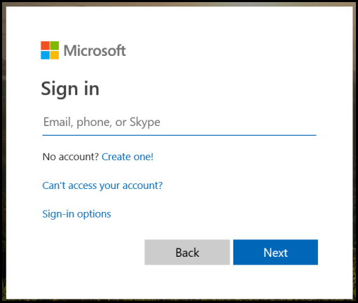

1. Select *Environments* in the tab bar (Note: you may need to expand the Left Navigation bar options to see it). Then select your automatically created environment. Select default.

   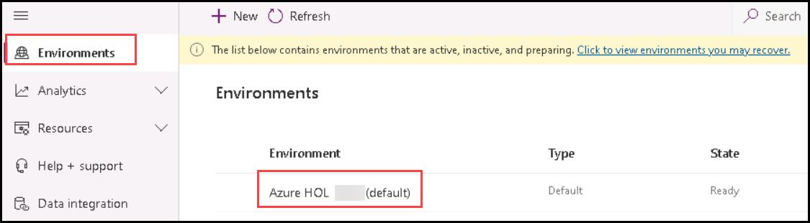

1. Select **Add database** as shown below.

   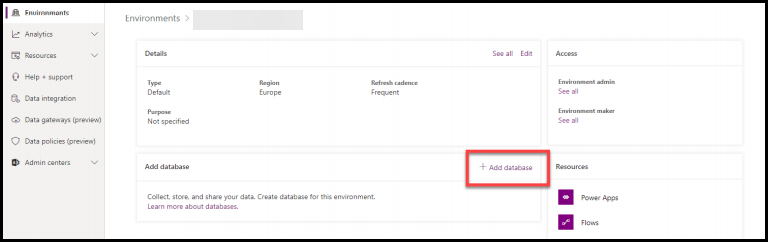

1. Specify values in the *Create a database for this environment* dialog box. Use these values:
   
   * Currency: USD
   * Language: English
   
   Then click **Add**

   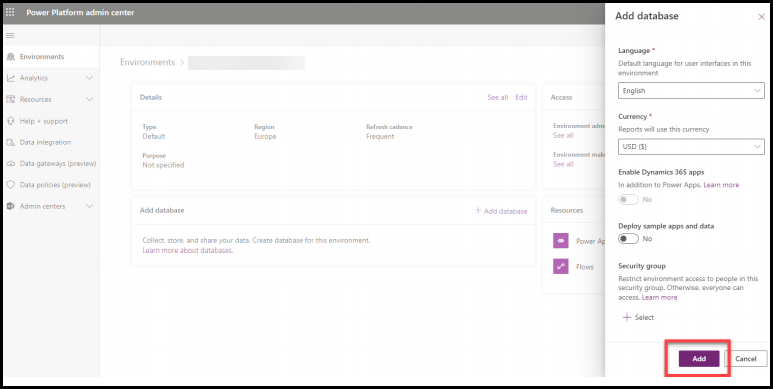

   > ***Note*** : creating a database may take up to one minute. Your environment will be ready after the database is provisioned.

### Check installed required software on your Lab VM

1. Click on **Power Automate Desktop** icon on the lab VM desktop to launch *Power Automate Desktop*. 

   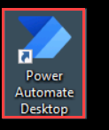

1. In the opened window, click “Sign in” and use the provided credentails from Environment details tab.

   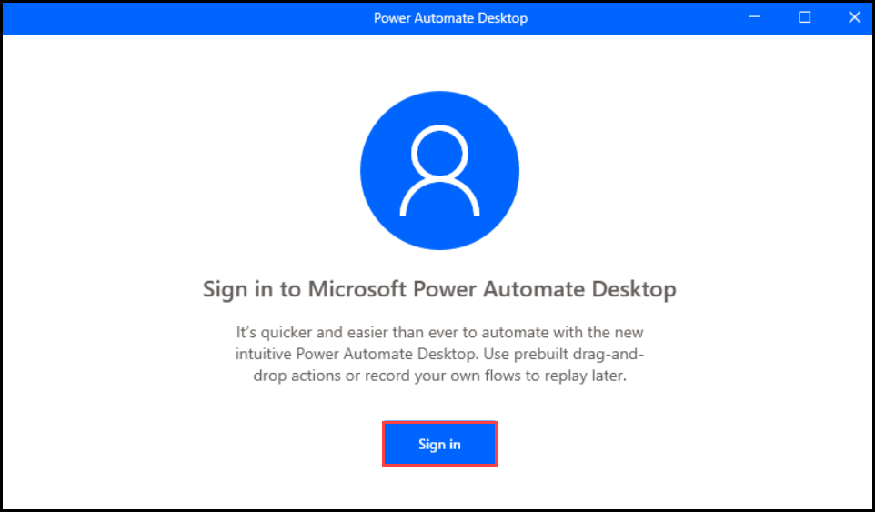

1. In the search bar search for **on-premises data gateway** and provide the username from Environment details tab and click on **Sign in**. Provide the credentials from Environment details tab if required.

   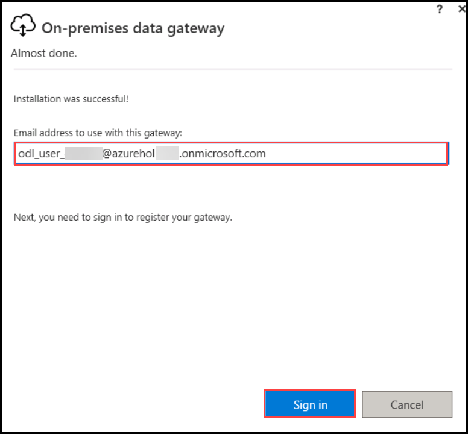

1. Select **Register a new gateway on this computer**, then click **Next**.

   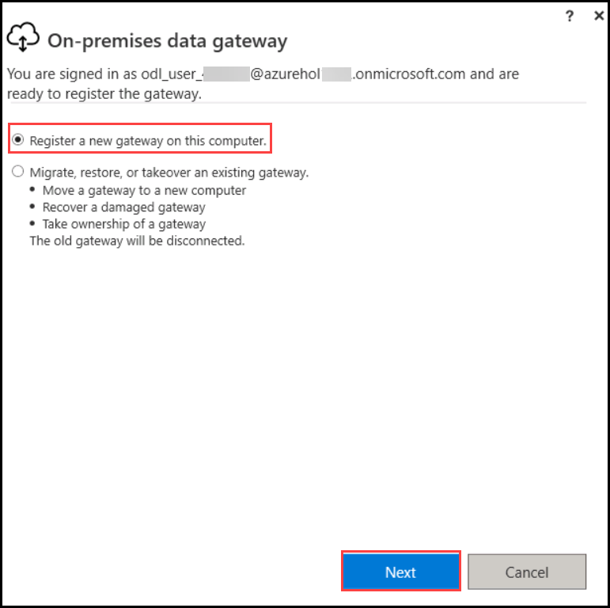

1. It is recommended to name your gateway as **Your computer name gateway**. Create a **recovery key**, then click **Configure**.
   
   > ***Note*** : the gateway region must match the region of the Power Automate environment that being used in this lab. (The environment that you created earlier, or the one your instructor asks you to use for this class. Check with your instructor if you are not sure which region the gateway should match to. By default, the gateway installer will automatically configure to use the same region as the default environment of the tenant you are using. If you must change the Gateway to a different region, click the fine text of “Change Region” as shown in the last line in the setup page below. Note, if you already finished install the gateway, but mistakenly installed to the wrong region, to switch to a different region, you have to uninstall the gateway from “Add and remove program” and reinstall the gateway.

   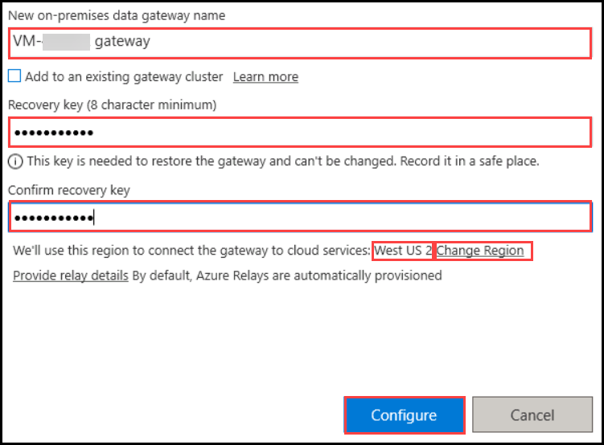

1. Now your gateway is ready to be used. Click **Close**.

   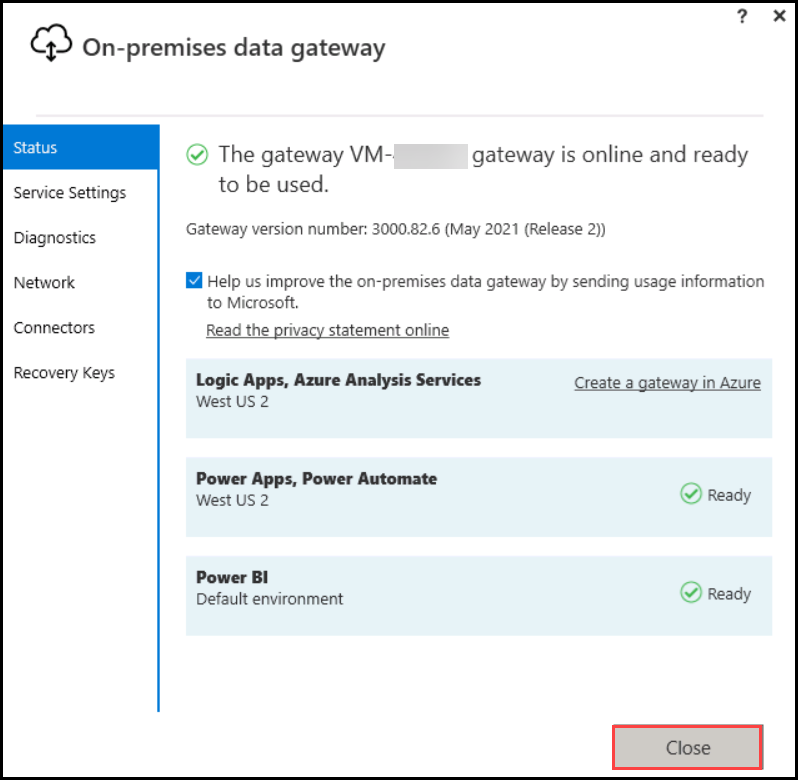

1. Click on **Contoso Invoicing** icon on the lab VM desktop to launch *Contoso Invoice App*. We will use this app for both the Process advisor and Robotic Processing Automation recordings.

   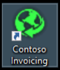

   > ***Note*** : you will need to click “More Information” and “Run it anyway” during installation of the Contoso app if Windows Defender prompts you that the app is coming from untrusted source

1. Now we can get familiar with Contoso Invoice App so we can better prepare for the following lab recording exercises

   * Open Contoso Invoice App
   * Click Invoices

   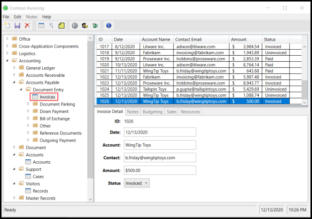

1. Click **New record** button on the left to create a new invoice.

   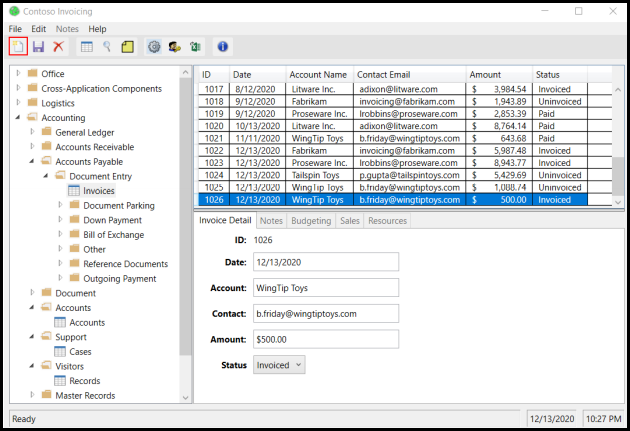

1. You can fill any information for the new invoice in the text boxes.

   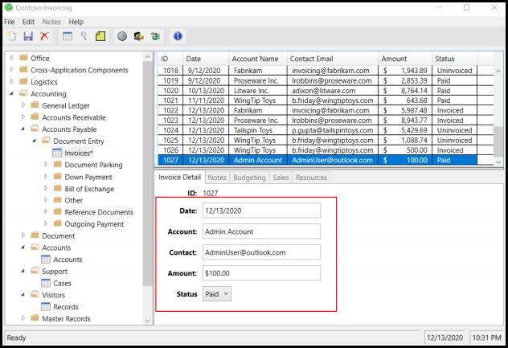

1. Click **Save** button on the left to save your new invoice

   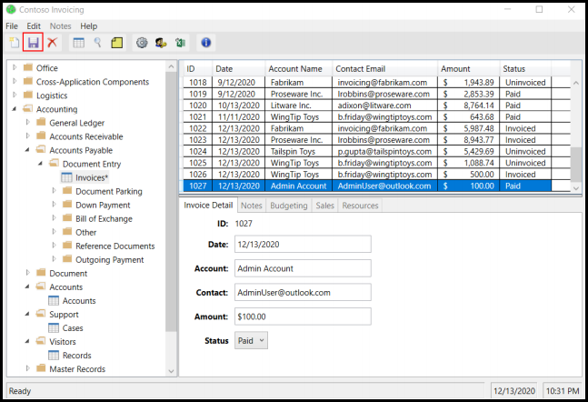
   
Once this is completed you can proceed with the lab using the lab guide. The rest of the exercises are available in the lab VM at ***C:\RPAIAD\RPAinADay-Student\lab manuals in pdf***, you can start from **Lab 2 How to generate insights to optimize and automate your process using process advisor**.

